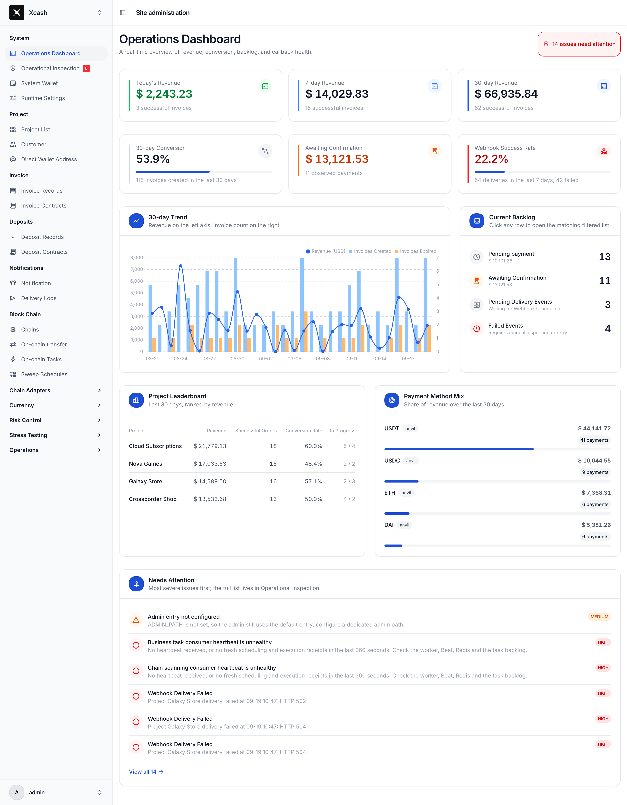
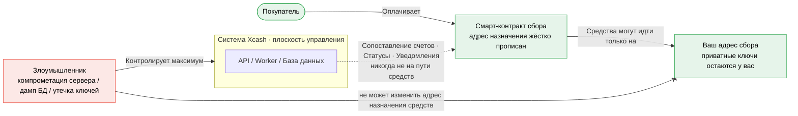
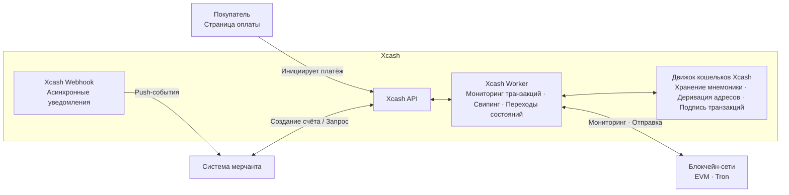

<div align="center">

[English](README.en.md) · **Русский** · [简体中文](README.md)

# Xcash

**Самостоятельно размещаемый, некастодиальный шлюз криптоплатежей**

Принимайте USDT, USDC, ETH и любые ERC-20 токены на основных EVM-сетях — плюс USDT в сети Tron.
Средства проходят через смарт-контракты напрямую на ваш собственный кошелёк:
**нулевая комиссия платформы, без KYC, никто не стоит между вами и вашими деньгами.**

<p>
  <a href="https://xca.sh"></a>
  <a href="https://xca.sh/docs/"></a>
  <a href="https://github.com/xca-sh/xcash/stargazers"></a>
  <a href="LICENSE"></a>
  
  
</p>

<p>
  <a href="#быстрый-старт">Быстрый старт</a> ·
  <a href="https://xca.sh/docs/">Документация</a> ·
  <a href="API.ru.md">Справочник API</a> ·
  <a href="https://xca.sh">Сайт</a>
</p>

<sub>Оплата в интернет-магазинах · Депозиты USDT · Трансграничные расчёты · SaaS-подписки · Кошельки и биржи</sub>

</div>



## Почему Xcash?

Хостинговые процессоры криптоплатежей стоят между вами и вашими деньгами: они берут средства под хранение до выплаты, взимают процент с каждой транзакции, требуют KYC и могут заморозить ваш аккаунт — или вовсе закрыться. Xcash придерживается противоположного подхода: шлюз работает на вашем сервере, а деньги никогда не перестают быть вашими.

- **Некастодиальный по архитектуре** — платежи проходят через минимальные смарт-контракты, адрес назначения которых жёстко прописан на ваш собственный адрес сбора. Система не имеет ключей к вашим бизнес-средствам, поэтому полный дамп базы данных ничего не даст злоумышленнику. Xcash занимается сопоставлением счетов, подтверждениями и уведомлениями — он никогда не находится на пути движения средств.
- **Нулевая комиссия платформы** — никакого процента при самостоятельном размещении. Вы платите только за газ в сети, а пакетная сборка средств удерживает стоимость свипа на уровне обычного токен-перевода.
- **Стейблкоины в приоритете, мульти-сеть** — любой ERC-20 на Ethereum, BNB Chain, Arbitrum, Base, Polygon, Optimism и других EVM-сетях; USDT и нативный TRX на Tron.
- **Два режима сбора в одной системе** — оплата счетов для чекаутов и подписок, плюс выделенные депозитные адреса в стиле биржи для платформ, ведущих балансы пользователей.
- **Готов к продакшену из коробки** — изоляция мерчантов / проектов, скоринг рисков MistTrack, надёжные вебхуки, совместимость с EasyPay V1, развёртывание одной командой через Docker.

### Сравнение

|  | **Xcash** (self-hosted) | Хостинговые процессоры¹ | BTCPay Server |
|---|:---:|:---:|:---:|
| Хранение средств | Некастодиальный — напрямую на ваш кошелёк | Процессор хранит средства до выплаты | Некастодиальный |
| Комиссия платформы | **0** | обычно 0,4%–1% за транзакцию | 0 |
| KYC / одобрение аккаунта | Нет | обычно требуется | Нет |
| Стейблкоины на EVM + Tron | Любой ERC-20, плюс Tron USDT | зависит от провайдера | Bitcoin в первую очередь; альткоины через плагины |
| Депозитные адреса в стиле биржи | Встроено | редко | — |
| Протокол EasyPay (易支付) V1 | Совместим | — | — |

¹ например CoinPayments, NOWPayments, CoinGate.

## Быстрый старт

Запустите продакшен-шлюз за несколько минут. Вам потребуется Linux-сервер с Docker и домен, направленный на него:

```bash
git clone https://github.com/xca-sh/xcash.git
cd xcash
./scripts/init_env.sh    # генерирует .env со случайными секретами
# отредактируйте .env и задайте SITE_DOMAIN=pay.example.com
docker compose up -d
```

Встроенный Caddy слушает на `127.0.0.1:6688`; направьте ваш обратный прокси (Nginx, Caddy, …) на него для TLS. При первом запуске создаётся учётная запись администратора `admin` с паролем, случайно сгенерированным `init_env.sh` — скрипт выводит его один раз и сохраняет в `.env` как `DJANGO_DEFAULT_SUPERUSER_PASSWORD`, поэтому **сохраните его в менеджере паролей**. Далее в панели администратора:

1. Заполните RPC-эндпоинты для сетей, которые хотите включить (QuickNode / Alchemy / Infura; API-ключ TronGrid для Tron).
2. Пополните системный кошелёк небольшим количеством газа в каждой включённой сети.
3. Создайте проект, укажите адрес сбора и интегрируйтесь через [REST API](API.md).

[Руководство по развёртыванию](#руководство-по-развёртыванию) ниже описывает каждый шаг подробно; полная документация доступна на [xca.sh/docs](https://xca.sh/docs/).

> Не хотите управлять серверами? **[xca.sh](https://xca.sh)** — официальное облачное решение — первые $500 ежемесячного оборота без комиссии.

## Безопасность: почему скомпрометированный сервер не может украсть ваши средства

Допустим, сервер с Xcash полностью скомпрометирован — база данных скачана, секреты утекли. Пока ваш адрес сбора в порядке, ваши активы вне риска: платежи, совершённые до, во время и после инцидента, всё равно поступают на ваш кошелёк, потому что на сервере нет ничего, что могло бы их перенаправить.

Безопасность — это структурное свойство Xcash, а не надстроенная функция:

- **Xcash никогда не берёт ваши средства под хранение.** Средства не проходят через аккаунт, которым система управляет от вашего имени.
- **Контракты жёстко прописывают адрес назначения.** Смарт-контракты сбора могут направлять средства только на ваш адрес сбора — злоумышленник не может это переписать.
- **Контракт сбора намеренно минимален.** Одна задача, минимальная поверхность атаки.



Путь средств (зелёный) зафиксирован смарт-контрактом и всегда идёт только *покупатель → контракт сбора → ваш адрес сбора*. Xcash сам по себе — это плоскость управления (сопоставление счетов, переходы состояний, уведомления) и **не находится на пути средств**. Даже злоумышленник с полным контролем над системой Xcash видит максимум данные счетов — он не может изменить, куда идут деньги.

## Два способа получать платежи

Xcash предоставляет два режима сбора. Определите, какой подходит вашему бизнесу, прежде чем интегрироваться:

- **Оплата счетов** — каждая транзакция создаёт счёт с фиксированной суммой и ограниченным сроком действия, который завершается, когда покупатель оплачивает. Поддерживает как прямой сбор на кошелёк, так и сбор через смарт-контракт, где каждый счёт получает независимый адрес контракта — без коллизий адресов, без подмены сумм, высокая конкурентность по умолчанию. Идеально для чекаутов интернет-магазинов и подписочного биллинга.
- **Депозиты** — каждый пользователь получает выделенный депозитный адрес, общий для всех сетей и отслеживаемый в реальном времени. Пользователи переводят средства когда угодно и получают зачисление после подтверждения блока — без необходимости создавать заказ — такой же UX, как у биржи. Идеально для кошельков, торговых платформ и любого бизнеса, ведущего балансы пользователей.

Оплата счетов поставляется со встроенной страницей оплаты для покупателя, готовой к использованию из коробки на английском и китайском:


## Возможности

| Функция | Описание |
|---------|----------|
| Оплата счетов | Счета с фиксированной суммой и ограниченным сроком для чекаутов, подписок и разовых платежей |
| Депозиты | Выделенные депозитные адреса для каждого пользователя с зачислением после подтверждения — UX в стиле биржи |
| Некастодиальность | Средства проходят через смарт-контракты напрямую на ваш кошелёк; Xcash никогда не хранит средства |
| Нулевая комиссия | Никакого процента от транзакций при самостоятельном размещении; только небольшие расходы на газ |
| Мульти-сеть, мульти-токен | Основные EVM-сети с любым ERC-20 токеном; USDT и TRX на Tron |
| Мульти-мерчант, мульти-проект | Изолированные мерчанты и проекты на одном инстансе, каждый со своими ключами аутентификации и адресом сбора |
| Контрактные счета | Независимый адрес контракта для каждого счёта, автоматический свип после подтверждения |
| Ончейн-скрининг рисков | Скоринг рисков MistTrack для адресов плательщиков и источников депозитов, доступный через API и вебхуки |
| Вебхук-колбэки | События платежей и депозитов в реальном времени, автоматические повторы, идемпотентность на основе nonce |
| Совместимость с EasyPay | Стандартный протокол EasyPay (易支付) V1 для безболезненной миграции с устаревших систем |
| REST API | Чистые RESTful эндпоинты с HMAC-SHA256 подписью запросов |
| Docker-развёртывание | Развёртывание в продакшен одной командой через Docker Compose |

## Работает с вашим существующим стеком

В зависимости от того, что вы используете, вам может вообще не потребоваться писать код интеграции:

- **WooCommerce** — официальный плагин **Xcash для WooCommerce** добавляет оплату USDT, USDC и другими криптовалютами в WordPress-магазин за несколько шагов. [Скачать](https://xca.sh/#integration)
- **Экосистема EasyPay (易支付)** — любая система, уже поддерживающая стандартный протокол EasyPay V1, подключается без переписывания существующей интеграции: Xboard, V2board, New API, 独角数卡, 异次元发卡 (WHMCS в разработке).

Всё остальное интегрируется через [REST API](API.md): несколько HMAC-подписанных вызовов для создания счёта или выдачи депозитного адреса, плюс вебхуки, пушащие события платежей и депозитов в реальном времени — включая скоринг рисков MistTrack.

## Поддержка сетей

| Функция | ETH | BNB Chain | Arbitrum | Base | Tron | Polygon | Optimism |
|:--:|:---:|:---------:|:--------:|:----:|:----:|:-------:|:--------:|
| Платежи | Да | Да | Да | Да | Да | Да | Да |
| Депозиты | Да | Да | Да | Да | Да | Да | Да |

Дополнительные EVM-сети можно включить, заполнив RPC-эндпоинт в панели администратора.

## Поддержка токенов

| Тип сети | Нативные активы | Стандарт токенов | Текущий охват | Как включить |
|:------:|:--------:|:--------:|:------------|:---------:|
| EVM | ETH, BNB, POL и др. (используются для газа) | ERC-20 | Любой ERC-20 токен — добавляйте USDT, USDC или любой другой, нужный вашему бизнесу | Добавьте адрес контракта токена в панели администратора и включите сеть |
| Tron | TRX | TRC-20 | USDT и нативный TRX; другие TRC-20 токены пока не доступны для платежей и депозитов | Настройте Tron RPC / ключ TronGrid и включите активы |

## Расходы на газ и сбор средств (свипинг)

При включённом сборе через контракт каждый счёт и каждый пользователь депозита получает **независимый адрес сбора**. Очевидное беспокойство: при таком количестве адресов, вы платите газ за сбор каждого платежа?

**Нет.** Xcash управляет свипингом с помощью двух порогов, которые минимизируют количество свипов — и общий расход газа:

- **Задержка свипа (пакетная обработка)** — подтверждённые средства не собираются немедленно; система ждёт настраиваемый интервал (по умолчанию **60 минут** на EVM, **6 часов** на Tron). Несколько платежей, поступивших на один адрес в пределах интервала, **объединяются в один свип** вместо оплаты газа за каждый платёж.
- **Порог стоимости свипа** — когда задержка истекает, адрес с балансом ниже порога (по умолчанию **1 USD**) **пропускается и продолжает накапливать средства**, поэтому вы никогда не платите за газ больше, чем стоит пыль.

**Свип запускается только когда оба условия — достигнута задержка и превышен порог — выполнены.** Адреса ниже порога не забрасываются: новые поступления заново запускают проверку, и свип происходит, когда баланс достигает порога. Оба параметра настраиваются для каждой сети в панели администратора.

Контракт сбора остаётся минимальным: свип по сути является обычным токен-переводом, почти без дополнительных контрактных накладных расходов.

Более того, свипинг — это **безразрешительная и безопасная операция**:

- Функция `collect()` контракта сбора **не имеет контроля доступа** — любой аккаунт может инициировать свип и лишь оплачивает газ, потому что адрес назначения жёстко прописан на ваш адрес сбора; неважно, кто вызывает функцию.
- Помимо автоматических гейтированных свипов, вы можете **запустить ручной свип в любое время**, обходя задержку и порог.
- Автоматический или ручной, кем бы ни был вызывающий — средства **всегда идут только на ваш адрес сбора**, и Xcash никогда их не трогает (см. [Безопасность](#безопасность-почему-скомпрометированный-сервер-не-может-украсть-ваши-средства)).

Таким образом, вам нужно лишь поддерживать небольшой баланс нативного актива в системном кошельке для оплаты газа за свипы (см. [шаг 6 развёртывания](#6-пополните-системный-кошелёк-газом)); ваши реальные расходы на газ определяются частотой свипов и порогом, которые вы выбираете.

## Встроенный скрининг рисков

Xcash включает возможности запросов рисков, кеширования, хранения и отображения; фактическая разведка по рискованным адресам поступает из внешнего сервиса MistTrack (SlowMist) — это не внутренний чёрный список и не собственная ончейн-модель рисков.

Проверки рисков охватывают две основные точки входа средств:

- **Оплата счетов** — после сопоставления счёта с ончейн-платежом адрес плательщика проверяется асинхронно, и уровень риска и скоринг сохраняются в записи счёта.
- **Депозиты** — после создания записи депозита адрес-источник проверяется асинхронно, и уровень риска и скоринг сохраняются в записи депозита.

Результаты также записываются в специальные записи **оценки рисков** — статус запроса, тип цели, адрес-источник, хэш транзакции, уровень риска, скоринг — чтобы операторы могли просматривать, одобрять или эскалировать из панели администратора. Пейлоады API/вебхуков счетов и депозитов содержат `risk_level` и `risk_score`, что позволяет мерчант-системам отображать риски или подключать собственную логику обработки.

Xcash предпочитает MistTrack OpenAPI V3; если API-ключ MistTrack не настроен, используется фолбэк через аддон QuickNode MistTrack. Если не настроено ни то, ни другое, скрининг рисков отключён.

## Архитектура



## Руководство по развёртыванию

### Предварительные требования

- Linux-сервер, рекомендуется Ubuntu 22.04+ или Debian 12+
- Docker и Docker Compose
- Домен, направленный на IP сервера
- RPC-эндпоинты для сетей, которые вы хотите включить
- API-ключ TronGrid, если нужны платежи через Tron

Рекомендуемые конфигурации сервера:

| Режим производительности | Оборудование | Ёмкость EVM-сетей |
|:-------:|:-------:|:-----------:|
| low | 1 CPU / 2 ГБ | 2–3 EVM-сети |
| medium | 4 CPU / 8 ГБ | 8–15 EVM-сетей |
| high | 8 CPU / 16 ГБ | 15–30 EVM-сетей |

`PERFORMANCE` можно задать в `.env` как `low`, `medium` или `high`; по умолчанию используется `low`.

Платежи и депозиты на EVM обнаруживаются и подтверждаются через сканирование ончейн-событий, оба включены по умолчанию и мониторятся совместно. Фактическая ёмкость сетей зависит от пропускной способности RPC, скорости блоков и объёма событий, поэтому выбирайте профиль производительности с запасом.

### 1. Клонируйте репозиторий

```bash
git clone https://github.com/xca-sh/xcash.git
cd xcash
```

### 2. Инициализируйте переменные окружения

```bash
./scripts/init_env.sh
```

Скрипт генерирует `.env` и заполняет случайные секреты и пароль базы данных, необходимые при запуске.
Если `.env` уже существует, скрипт отказывается его перезаписывать и завершается; сделайте резервную копию и удалите старый файл, если нужно сгенерировать заново.

### 3. Настройте домен доступа

Отредактируйте `.env` и задайте `SITE_DOMAIN`:

```env
SITE_DOMAIN=xcash.example.com
```

Убедитесь, что DNS домена указывает на IP сервера, и настройте обратный прокси, такой как Nginx или Caddy, для перенаправления трафика на `http://localhost:6688`.

#### Ваш обратный прокси должен пробрасывать реальный IP клиента и протокол

**Этот шаг не является опциональным.** Белый список IP мерчантов, троттлинг входа и все лимиты API привязаны к реальному IP клиента, а HSTS и Secure cookies зависят от протокола запроса. Если ваш обратный прокси не пробрасывает оба, Xcash всегда видит только адрес Docker-шлюза, что означает:

- белый список IP мерчантов отклоняет каждый запрос;
- все IP-лимиты схлопываются в один общий бакет, поэтому кто угодно может исчерпать лимит входа и заблокировать всех администраторов;
- Django всегда считает, что запрос пришёл по обычному HTTP, поэтому HSTS никогда не отправляется.

**Nginx:**

```nginx
location / {
    proxy_pass http://127.0.0.1:6688;
    proxy_set_header Host $host;
    # Реальный IP клиента. Используйте $remote_addr, который перезаписывает заголовок
    proxy_set_header X-Real-IP $remote_addr;
    # Оригинальный протокол; HSTS и Secure cookies зависят от него
    proxy_set_header X-Forwarded-Proto $scheme;
}
```

> ⚠️ Не полагайтесь на `proxy_set_header X-Forwarded-For $proxy_add_x_forwarded_for;` как единственный источник. Он **добавляет**, поэтому самый левый элемент приходит прямо из клиентского запроса и может быть подделан. Xcash предпочитает `X-Real-IP`, поэтому конфигурация выше безопасна.

**Caddy** (Caddy автоматически пробрасывает `X-Forwarded-For` и `X-Forwarded-Proto`, дополнительные заголовки не нужны):

```caddyfile
xcash.example.com {
    reverse_proxy 127.0.0.1:6688
}
```

**Если вы открываете порт 6688 за пределы хоста** (установив `LISTEN_TO=0.0.0.0` в `.env`, например, если обратный прокси на отдельной машине), вы также должны ограничить диапазон доверенных прокси, иначе любой, кто может достичь этого порта, сможет подделать IP клиента:

```env
# По умолчанию private_ranges; задайте фактический IP вашего обратного прокси
CADDY_TRUSTED_PROXIES=203.0.113.10
```

Опционально: задайте `ADMIN_PATH` для переноса входа в админку на пользовательский путь, например:

```env
ADMIN_PATH=secure-admin
```

Если не задано, панель администратора остаётся на корневом пути сайта и показывает напоминание о безопасности в правом верхнем углу.

### 4. Запустите сервисы

```bash
docker compose up -d
```

Стартовый скрипт сначала применяет миграции базы данных и загружает эталонные данные по умолчанию, такие как сети и валюты. При первом запуске, если учётной записи администратора ещё нет, создаётся аккаунт `admin` с паролем `DJANGO_DEFAULT_SUPERUSER_PASSWORD` из `.env` (случайно сгенерирован `scripts/init_env.sh`, выведен один раз при запуске).

В целях безопасности, в продакшене (`DEBUG=False`) система **отказывается создавать учётную запись администратора и прерывает обновление**, если этот пароль пуст, короче 12 символов или равен значению-заглушке, поставляемому в репозитории — панель администратора находится на корневом пути сайта, если `ADMIN_PATH` не задан, поэтому слабый пароль передаёт суперпользовательский доступ.

Рекомендуется также задать `ADMIN_PATH` для переноса панели с пути по умолчанию.

### 5. Настройте RPC сетей

Базовая информация по основным сетям предзагружена, но **RPC-эндпоинты необходимо заполнить вручную**, прежде чем шлюз сможет взаимодействовать с блокчейнами.

Войдите в панель администратора, перейдите в **Блокчейн → Публичные сети** и заполните RPC-эндпоинты для сетей, которые хотите использовать. Рекомендуемые провайдеры: [QuickNode](https://www.quicknode.com/), [Alchemy](https://www.alchemy.com/) и [Infura](https://www.infura.io/). Платежи через Tron требуют API-ключ [TronGrid](https://www.trongrid.io/).

### 6. Пополните системный кошелёк газом

Войдите в панель администратора, перейдите в **Система → Системные кошельки**, скопируйте адрес системного кошелька и отправьте небольшую сумму нативного актива (ETH, BNB, POL, …) на него в каждой включённой EVM-сети.

Системный кошелёк используется только для инфраструктурных транзакций, которые система должна инициировать сама — развёртывание контрактов, свипы контрактов и подобные ончейн-операции. Бизнес-средства по-прежнему идут на ваш адрес сбора согласно правилам контракта. Не размещайте здесь бизнес-средства; держите ровно столько газа, сколько нужно для покрытия последних операций, чтобы развёртывания и свипы никогда не блокировались. Свипы не являются per-payment — задержка и пороги пакетируют их для снижения расхода газа, см. [Расходы на газ и сбор средств (свипинг)](#расходы-на-газ-и-сбор-средств-свипинг).

### 7. Настройте проект

Войдите в панель администратора, перейдите в **Проекты → Список проектов** и создайте или отредактируйте проект. Проект — это базовая единица изоляции для API-интеграции; у каждого свой `Appid` и `HMAC-секрет` для аутентификации и подписи.

Убедитесь как минимум в следующем:

- **Белый список IP** — ограничивает, какие IP серверов мерчанта могут вызывать API шлюза. `*` подходит для тестирования; в продакшене сузьте до фиксированных egress IP или CIDR-диапазонов.
- **URL уведомлений** — получает события вебхуков платежей, депозитов и прочие; проект отображается как *не готов*, пока не настроен.
- **Адрес сбора** — конечный адрес назначения бизнес-средств. Перед включением контрактных платежей или депозитов необходимо настроить мультисиг-адрес EVM; он записывается в правила контракта и **не может быть изменён после установки**.

## API-интеграция

После развёртывания следуйте [документации API](https://xca.sh/docs/#api-base) для интеграции платежей, депозитов и вебхук-колбэков. Машиночитаемый справочник также доступен в [API.md](API.md).

При создании счёта можно указать `notify_url` на уровне счёта, который переопределяет вебхук проекта по умолчанию; EasyPay V1-совместимая точка входа `submit.php` также маппит `notify_url` на URL уведомлений уровня счёта.

## Резервное копирование и восстановление

### Два элемента, которые необходимо бэкапить вместе

Xcash хранит мнемоники кошельков, зашифрованные AES-256-GCM. Ключ шифрования находится не в базе данных — он находится в `.env` как `WALLET_MNEMONIC_ENCRYPTION_KEY`. Поэтому:

| Что бэкапить | Где находится | Если у вас есть только это |
| --- | --- | --- |
| Данные Postgres | Контейнер `db` / том `db_data` | Мнемоники невозможно расшифровать — бэкапа нет |
| `.env` | Корень проекта | Нет бизнес-данных — бэкапа нет |

**Они должны быть сохранены как пара, из одной точки времени.** Ни одна половина не может восстановить кошелёк сама по себе. Потеря `WALLET_MNEMONIC_ENCRYPTION_KEY` невосстановима: ключи горячего кошелька потеряны навсегда, и свипинг перестаёт работать безвозвратно.

> Дамп, который `scripts/upgrade.sh` создаёт для репетиции миграции **не является бэкапом**: он удаляется, как только репетиция проходит успешно, и сохраняется только при неудаче, для отладки. Настройте свои собственные независимые запланированные бэкапы.

### Резервное копирование базы данных

```bash
docker compose exec -T db sh -c 'pg_dump --format=custom --no-owner --no-privileges -U "$POSTGRES_USER" -d "$POSTGRES_DB"' > xcash-$(date +%Y%m%d-%H%M%S).dump
```

Рекомендации:

- Как минимум ежедневно, и отправляйте дамп вместе с `.env` в зашифрованное хранилище **вне этого сервера** (бэкап на том же хосте не переживёт ни отказа диска, ни потери хоста).
- `.env` редко меняется, поэтому одной офлайн-копии достаточно (менеджер паролей или бумага) — нет необходимости загружать его ежедневно.
- Периодически проводите репетицию восстановления. Бэкап, который вы никогда не восстанавливали — это не бэкап.

### Восстановление

```bash
# 1. Остановите сервисы приложения, оставьте базу данных работать
docker compose stop django worker worker-scan beat

# 2. Верните .env на место (это должна быть копия, соответствующая этому дампу)

# 3. Загрузите дамп (целевая база данных должна быть пустой)
docker compose exec -T db sh -c 'pg_restore --exit-on-error --no-owner --no-privileges -U "$POSTGRES_USER" -d "$POSTGRES_DB"' < xcash-YYYYmmdd-HHMMSS.dump

# 4. Запустите сервисы обратно
docker compose up -d
```

## Эксплуатация

Показать статус сервисов:

```bash
docker compose ps
```

Остановить сервисы (контейнеры удаляются, тома базы данных сохраняются):

```bash
docker compose down
```

Обновить до последней версии (убедитесь, что вы на ветке `main`):

```bash
git pull
./scripts/upgrade.sh
```

Скрипт собирает образы, при необходимости репетирует миграции, останавливает старые сервисы, запускает продакшен-миграции и поднимает новую версию, сообщая об успехе только после прохождения всех проверок готовности. При ошибке завершается с ненулевым кодом и оставляет сервисы на месте для диагностики. Требует чистое рабочее дерево; каждое ожидание готовности по умолчанию 360 секунд и может быть изменено через `APP_READY_TIMEOUT`.

### Внешний мониторинг

Страница операционной инспекции в админке проверяет статус сканирования и воркеров в реальном времени при каждом открытии. Чтобы получать алерты, когда никто не смотрит в админку, настройте мониторинг аптайма на эти неаутентифицированные эндпоинты в продакшене и алертите на не-200 ответы или таймауты:

| Эндпоинт | Что проверяет |
| --- | --- |
| `GET /health` | Сервис работает, PostgreSQL доступен для запросов, Redis доступен для чтения и записи |
| `GET /health/scanning` | Сканирование каждой активной сети продвигается без постоянных ошибок |
| `GET /health/workers` | Оба пула воркеров имеют свежие хартбиты планирования и выполнения |

`/health/scanning` реагирует на единичный сбой RPC, поэтому настройте порог последовательных ошибок в вашем мониторе. Сразу после первого запуска `/health/workers` возвращает 503, пока оба пула воркеров не выполнят хартбит; это ожидаемое поведение.

## Технологический стек

- **Бэкенд**: Django 5.2 + Django REST Framework
- **Очередь задач**: Celery + Redis
- **База данных**: PostgreSQL
- **Блокчейн-взаимодействие**: web3.py (EVM)
- **Деривация кошельков**: HD-кошельки BIP44 (bip-utils)
- **Страница оплаты**: React 19 + Vite + Tailwind CSS
- **Развёртывание**: Docker Compose

## Дорожная карта

- [x] Поддержка Tron
- [ ] Поддержка Solana
- [ ] Улучшения сайта документации

## Облачная версия

Если вы предпочитаете не разворачивать и поддерживать Xcash самостоятельно, используйте официальную хостинговую версию на **[xca.sh](https://xca.sh)** — без развёртывания, без обслуживания, постоянно обновляется.

Комиссии зависят от месячного оборота и начисляются по уровням: **первые $500 каждый месяц бесплатно**, затем 1% → 0,8% → 0,6% → 0,4% по мере роста оборота. Самостоятельное размещение остаётся бесплатным и без комиссий в любом случае.

## Поддержка

- **Баги и вопросы**: [создайте issue](https://github.com/xca-sh/xcash/issues)
- **Коммерческая поддержка**: tech@xca.sh

## Вклад в проект

Issues и pull requests приветствуются — см. [CONTRIBUTING.md](CONTRIBUTING.md).

Если Xcash экономит вам деньги, поставьте ⭐ — это помогает другим мерчантам найти проект.

## Лицензия

[MIT](LICENSE)

